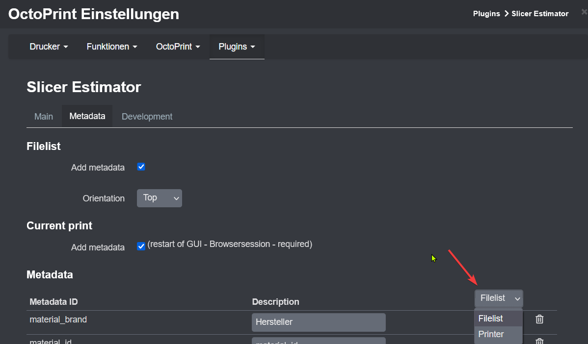

# API documentation for other developers
I implemented an API that the functionallity of Slicer Estimator can also be used by other plugins. This avoids the need to build a separate configuration page and also to set everything again for every plugin.

If your plugin is registered it will be added to the configuration dropdown like it is a function of Slicer Estimator. Also some [generic events](#events) are send to the event bus of OctoPrint.



# API description
## Summary
You can find the official API documentation in the helpers section of OctoPrints documentation: https://docs.octoprint.org/en/master/plugins/helpers.html

The following commands are exposed:
* **register_plugin**: Used to register a plugin to the API.
* **register_plugin_target**: Used to specify different target to show the metadata like the Filelist and the Printer View in Slicer Estimator Plugin
* **unregister_plugin**: To delete all setting. Helpful to reset the registration during development. Uninstalled plugins will be cleansed automatically
* **unregister_plugin_target**: If a target should not be used anymore. This have to be used of a external plugin is changed that perhaps a target is not used anymore. It will also delete all settings of the target.
* **get_registered_plugins**: Lists the registered Plugins for checks
* **get_registered_plugin_targets**: Listes the registered targets for a plugin.
* **get_metadata_file**: return the formatted metadata for a file for a specific target.


To integrate the API it can be called in on_after_startup():
```python
    def on_after_startup(self):
        # Example for API calls
         helpers = self._plugin_manager.get_helpers("SlicerEstimator", 
                                                   "register_plugin", 
                                                   "register_plugin_target",
                                                   "unregister_plugin",
                                                   "unregister_plugin_target",
                                                   "get_metadata_file"
                                                   )
        if helpers is None:
            self._logger.info("Slicer Estimator not installed")
        else:            
            self.se_register_plugin = helpers["register_plugin"]
            self.se_register_plugin_target = helpers["register_plugin_target"]
            self.se_unregister_plugin = helpers["unregister_plugin"]
            self.se_unregister_plugin_target = helpers["unregister_plugin_target"]
            self.se_get_metadata_file = helpers["get_metadata_file"]
            
            self.se_register_plugin(self._identifier, self._plugin_name)
            self.se_register_plugin_target(self._identifier, "filelist_mobile_id","Filelist in Mobile")
            metadata = self.se_get_metadata_file(self._identifier,"filelist_mobile_id", "local", "Wanderstöcke Halterung.gcode")

```
You can enhance the logic like checking if a plugin is still registered. But anyhow, there will be a log info if a plugin is still registered only.

To get the metadata configured for your plugins target you have to call:
```python
            metadata = self.get_metadata_file(self._identifier, "filelist_mobile_id", "local", "Wanderstöcke Halterung.gcode")
```

The plugin works only for local files but API is prepared to support other origins also.

The result is a simple list of arrays: [[metadata_id, metadata description, value], [metadata_id, metadata description, value], ...]

## Methods
### register_plugin(plugin_identifier, plugin_name)
Register a plugin to add it to the setting

    Args:
        plugin_identifier (String): OctoPrint Plugin Identifier
        plugin_name (String): OctoPrints plugins name (or any other name you like to use)

### register_plugin_target(plugin_identifier, target, target_name)
Register a target to an existing plugin - call multiple time for new targets

    Args:
        plugin_identifier (String): OctoPrint Plugin Identifier
        target (String): ID of a target (you can choose)
        target_name (String): Name of a target to use in the dropdown

### unregister_plugin(plugin_identifier)
Unrgister a plugin if you like to remove all settings

    Args:
        plugin_identifier (String): OctoPrint Plugin Identifier

### unregister_plugin_target(plugin_identifier, target)
Unrgister a plugins target if you like to remove all target settings

    Args:
        plugin_identifier (String): OctoPrint Plugin Identifier
        target (String): ID of a target (you can choose)


### get_registered_plugins
Return list of plugins registered

    Returns:
        array of strings: List of plugin identifiers registered

 ### get_registered_plugin_targets(plugin_identifier)
Returns list of targets registered for a plugin

    Args:
        plugin_identifier (String)): plugin_identifier to check

    Returns:
        array of strings: List of targets registered for a plugin

### get_metadata_file(plugin_identifier, target, origin, path):
Get the Metadata to a file in an Array containing a tripple array

    Args:
        plugin_identifier (String): OctoPrint Plugin Identifier
        target (String): ID of a target (you can choose)
        origin (String): only "local" supported actually
        path (String): Path to the file

    Returns:
        [Array]: Array of metadata in metadata_id, description and value

## Events
Slicer Estimator sends a custom event to the event bus if a print starts and metadata handling is enabled in settings. The event contains the metadata for all plugins registered as payload in same format returned from get_metadata_file method.

There is a bug in OctoPrint < 1.80. You should use the string comparison: [Details available here](https://github.com/OctoPrint/OctoPrint/issues/4417).

### Metadata
Event: Events.PLUGIN__SLICER_ESTIMATOR_METADATA_PRINT or "plugin_SlicerEstimator_metadata_print"

Payload: Payload[plugin_identifier][target]

```python
   def on_event(self, event, payload):
        if event == "plugin_SlicerEstimator_metadata_print":
            metadata_list = payload[self._identifier]["filelist_mobile_id"]
```

### Time to filament change
Also it sends after start of the print the remaining time to the filament chnages that other plugins can show this as well. Actually it is a single event only.

Event: Events.PLUGIN__SLICER_ESTIMATOR_FILAMENT_CHANGE or plugin_SlicerEstimator_filament_change

Payload: Dict of seconds the filament has to be changed