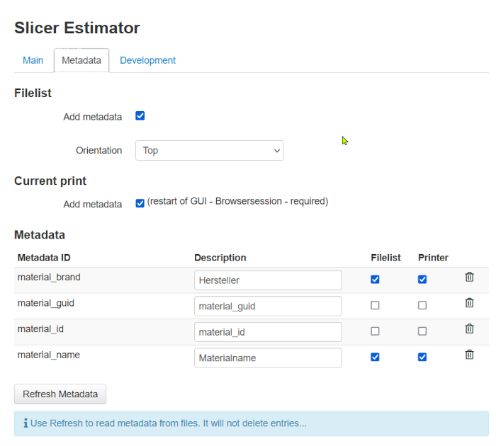

# Slicer Estimator is a generic implementation to read remaining time to print and custom metadata embedded in the GCODE file by the slicer

- [Slicer Estimator is a generic implementation to read remaining time to print and custom metadata embedded in the GCODE file by the slicer](#slicer-estimator-is-a-generic-implementation-to-read-remaining-time-to-print-and-custom-metadata-embedded-in-the-gcode-file-by-the-slicer)
- [Estimation](#estimation)
- [Metadata](#metadata)
- [Tool changes by MMU and M600](#tool-changes-by-mmu-and-m600)
  - [API - for other plugin developers](#api---for-other-plugin-developers)
  - [Slicers supported](#slicers-supported)
    - [Cura](#cura)
    - [Simplify3D](#simplify3d)
    - [PrusaSlicer](#prusaslicer)
    - [SuperSlicer](#superslicer)
    - [OrcaSlicer](#orcaslicer)
  - [Notes](#notes)

With this plugin you can use the more accurate estimation of the slicer instead of OctoPrints estimations. So it will be very accurate, as the slicer created each command of the GCODE. 
Also you can add custom metadata that will be added to the filebrowser to get e.g. the material the GCODE was created for.

The slicer is detected automatically, the default configurations supports the following slicers. Everything is done during upload so you have to upload a file again to get slicer estimator working.

* Cura
* Simplify3D
* PrusaSlicer
* SuperSlicer
* OrcaSlicer

# Estimation
Slicer Estimator detected the embedded remaining time if there is a checkmark right of the estimation:

Also the estimated time of an upload is updated if slicer comments are found.

# Metadata
Slicers can add comments to the GCODE to embed additional metadata in the file (like material brand, nozzle size, ... ). This metadata can be shown in OctoPrints filelist or printer state view.

If you like to show additional metadata not added by the slicer usually you have to use the following format (`;Slicer info:<key>;<value>`) which is e.g. mandatory for Cura.

Example for Cura 4.12 and newer (For Anycubic Mega S, Pro and X it is available by default. You can download an actual [printer profile here](https://github.com/NilsRo/Cura_Anycubic_MegaS_Profile))

    ;Slicer info:material_guid;{material_guid}
    ;Slicer info:material_id;{material_id}
    ;Slicer info:material_brand;{material_brand}
    ;Slicer info:material_name;{material_name}

Settings for metadata configuration

# Tool changes by MMU and M600
Filament changes via M600 (manual) or via MMU (T) are detected in GCODE. The time remaining to a change is shown in the filebrowser and also in print view. This gives an overview how much time is left until you should have an eye on the printer.

## API - for other plugin developers
Metadata stored can be easily used by other plugins. [An API description is available here](API_DOC.md).

## Slicers supported

### Cura
With Cura native no changes has to be applied to Cura. The overall print time is read out of a comment in the GCODE. For a correct estimation OctoPrints percentage done is used as there is only the overall print time available.
[Available placesholders](http://files.fieldofview.com/cura/Replacement_Patterns.html)

### Simplify3D
With Simplify3D no changes has to be applied to Simplify3D. The overall print time is read out of a comment in the GCODE. For a correct estimation OctoPrints percentage done is used as there is only the overall print time available.

### PrusaSlicer
Remaining time is read out of M73 commands added by PrusaSlicer. The slicer will update the remaining print time continuously. Also there is support to show the remaining times to filamnt changes.

### SuperSlicer
Remaining time is read out of M73 commands added by SuperSlicer. The slicer will update the remaining print time continuously. Also there is support to show the remaining times to filamnt changes.

### OrcaSlicer
Remaining time is read out of M73 commands added by OrcaSlicer. The slicer will update the remaining print time continuously. Also there is support to show the remaining times to filamnt changes.

## Notes
 * If no slicer is detected the original estimator from OctoPrint will be used.
 * In case SDCARD print is used the original estimator from OctoPrint will be used
 * Compared to slicer estimations the average estimation by OctoPrint (based on the average of the last real prints) could be more accurate. So you can change the settings if you like to use average estimation if available. It is not available for new GCODE files and could be slightly off if you preheat "sometimes". A green dot is shown if average estimation is used.
 * GCODE files are scanned and changed in background during uploading. There is no delay in start printing because it is done in the file upload API of OctoPrint.
 * If you like to see more details what happens in the background simply activate DEBUG mode in OctoPrint logging for the plugin. If you want open a ticket please attach the log there.
 * Be aware that other plugins could change the GCODE. This could interfere with Slicer Estimator.
 * Also adding e.g. linear advance to Cura in post processing will lead to a lower estimation as Cura does not know the changes done.
 * Due to general changes in the handling custom rules and M117 command of Cura is not supported anymore.
 * File is changed during upload, so it is neccessary to upload a file again to get a slicer based estimation.
 * Filament Changes will be updated after a print to have a more accurate estimation. So the time shown could be changing after multiple prints
