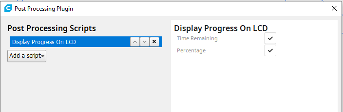
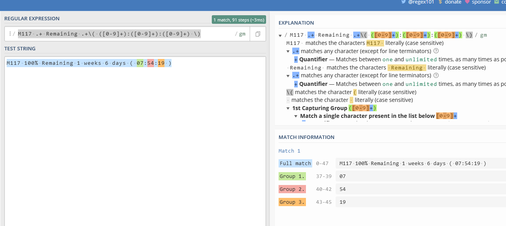

# Slicer Estimator is a generic implementation to read remaining time to print and custom metadata embedded in the GCODE file by the slicer
With this plugin you can use the more accurate estimation of time remaining of the slicer instead of OctoPrints estimations. So it will be very accurate, as the slicer created each command of the GCODE. 
Also you can add custom metadata that will be added to the filebrowser to get e.g. the material the GCODE was created for.

The slicer is detected automatically, the default configurations supports the following slicers. Also you can add custom settings according your needs for other slicers or requirements. 

* Cura
* Cura M117
* Simplify3D
* PrusaSlicer

Slicer Estimator detected the embedded remaining time if there is a checkmark right of the estimation:

Also the estimated time of an upload is updated if slicer comments are found. It is possible to deactivate this in the settings if perhaps another plugin is installed doing this.

# Support for custom metadata
From version 1.1.0 custom metadata is supported. Comments in GCODE that can be generated by the Slicer (like material brand,... ) and are added to the filelist. You can see now for which material the GCODE was created

The following has to be added in the Start G-Code (`;Slicer info:<key>;<value>`). You can add as much metadata as you like. Actually only the first 5000 rows are read after upload. Descriptions and and if you like to see the metadata in the filelist or printer state can be selected in the settings. **Systax changed from version 1.3.0 as description is maintanined in settings now but old styles are sill supported.**

Example for Cura 4.12 and newer:

    ;Slicer info:material_guid;{material_guid}
    ;Slicer info:material_id;{material_id}
    ;Slicer info:material_brand;{material_brand}
    ;Slicer info:material_name;{material_name}

For Anycubic Mega S, Pro and X it is available by default in newest Cura Release.

Metadata stored can be easily used by other plugins using the get_addtional_metadata function. A dictionary with key "slicer" is added to the file metadata.

For example:

    self._file_manager._storage_managers["local"].get_additional_metadata(<path of the file>,"slicer");

## Slicers supported

### Cura
With Cura native no changes has to be applied to Cura. The overall print time is read out of a comment in the GCODE. For a correct estimation OctoPrints percentage done is used as there is only the overall print time available.

Custom metadata: http://files.fieldofview.com/cura/Replacement_Patterns.html

### Cura M117
Remaining time is read out of M117 commands added by Cura if the Post-Processing actions are activated. The slicer will update the remaining print time continuously.

### Simplify3D
With Simplify3D no changes has to be applied to Simplify3D. The overall print time is read out of a comment in the GCODE. For a correct estimation OctoPrints percentage done is used as there is only the overall print time available.

### PrusaSlicer
Remaining time is read out of M73 commands added by PrusaSlicer. The slicer will update the remaining print time continuously.

## Notes
 * If no slicer is detected the original estimator from OctoPrint will be used.
 * In case SDCARD print is used the original estimator from OctoPrint will be used
 * Compared to slicer estimations the average estimation by OctoPrint (based on the average of the last real prints) could be more accurate. So you can change the settings if you like to use average estimation if available. It is not available for new GCODE files and could be slightly off if you preheat "sometimes". A green dot is shown if average estimation is used.
 * GCODE files are scanned in background so until the necessary information is found the OctoPrint estimator is used. There is no delay in start printing but with files of e.g. 150Mbyte in size the scan could take some seconds.
 * If you like to see more details what happens in the background simply activate DEBUG mode in OctoPrint logging for the plugin. If you want open a ticket please attach the log there.
 * Be aware that other plugins could change the GCODE. This could interfere with Slicer Estimator if Cura M117 or PrusaSlicer is used. Both reads GCODEs that perhaps will be overwritten by e.g. an ETA plugin.

## Custom Settings
Example: For the following command "M117 100% Remaining 1 weeks 6 days ( 07:54:19 )" you can use RegEx "M117 .+ Remaining ([0-9]+) weeks.+" with Match 1 to get the weeks. To get the minutes you should use "M117 .+ Remaining .+\( ([0-9]+):([0-9]+):([0-9]+) \)" and Match 2 to avoid an issue if weeks are not shown. 

 

I like to suggest regex101.com for testing and to get the right match group.

